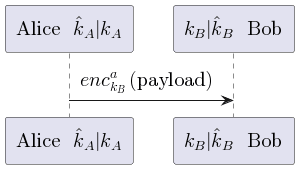
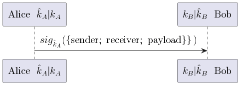
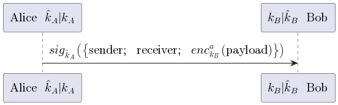
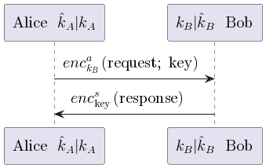

# Communication Layer

This layer provides functions to send and receive confidential and/or
authenticated messages. For each receive function the layer provides proofs of properties that are guaranteed by the respective cryptographic primitive. 
Additionally, the layer provides new predicates that lets the user specify their own
preconditions for sending messages.
 This layer provides the following functionalities:

**Confidential send and receive functions:**

**Authenticated send and receive functions:**

**Confidential and authenticated send and receive functions:**

**Response-request pair send and receive functions:**

## Overview

The communication layer can be divided into the core functions that send a
single message from a sender to a receiver and the functions that send and
receive request-response pairs.

The module `DY.Lib.Communication.Core` provides the functional code to send and
receive messages but does not give any security guarantees. The module
`DY.Lib.Communication.Core.Invariants` contains the cryptographic predicates and
event predicates that have to be included on the protocol level to get the security
guarantees from the communication layer. These predicates are combined with the
protocol predicates via the [split predicates
methodology](../utils/DY.Lib.SplitFunction.fst) used in DY*. The invariants are
proven for every function in the `DY.Lib.Communication.Core.Lemmas` module.
These proofs are used in a protocol analysis to prove the invariants for the send
and receive functions.
To get the guarantees from the functions more easily in a protocol analysis the `DY.Lib.Communication.Core.Properties` module contains various lemmas.

The request-response pairs are implemented with the same structure in the
`DY.Lib.Communication.RequstResponse.*` namespace.

Examples for how to use the communication layer functions
in a protocol can be found in this [repository](https://github.com/REPROSEC/dolev-yao-star-communication-layer-examples).
